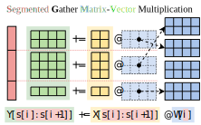

# CachedLLM: Efficient Multi-Tenant LoRA Serving with Dynamic Page Cache

> This project is built on top of the [vLLM](https://github.com/vllm-project/vllm) project

## Introduction

CachedLLM is a multi-tenant LoRA serving system designed to improve memory management and reduce memory exchange overhead. It leverages a dynamic page cache to store persistent states and LoRA adapters in main memory while caching them in VRAM across multiple invocations. This design significantly improves GPU utilization, latency, and throughput in VRAM-limited scenarios.

## Features

- Dynamic Page Cache: Stores data and weights in pages and dynamically manages the page cache based on access frequency.
- Efficient Kernel: Optimize SGMV kernel for paged LoRA
- Memory Management: Reduces memory fragmentation and improves VRAM utilization.

## Method
### Overview

### Paging mechanism

The adapter cache pool is divided into pages of equal size for fine-grained management, significantly reducing memory fragmentation and improving memory management efficiency.

### Cache Policy

CachedLLM uses a least-recently-used (LRU) cache policy to minimize the count of exchanging adapters between main memory and VRAM, reducing memory exchange overhead.

### Batched Computation

The batching mechanism in CachedLLM enables batching requests of different LoRA adapters, increasing the number of batched requests per computation and thus improving throughput.

We use optimized kernels based on SGMV in [punica](https://github.com/punica-ai/punica).

# Evaluation

## Task-Switching Overhead

CachedLLM achieved a notable reduction in task-switching overhead compared to vLLM and Huggingface, with up to a 10% overhead reduction.

## Throughput

CachedLLM demonstrated up to a 3x improvement in throughput compared to vLLM.

## Conclusion

CachedLLM offers significant improvements in latency, throughput, and memory management for multi-tenant LoRA serving scenarios. It efficiently manages VRAM usage, reducing task-switching overhead and improving batching efficiency.